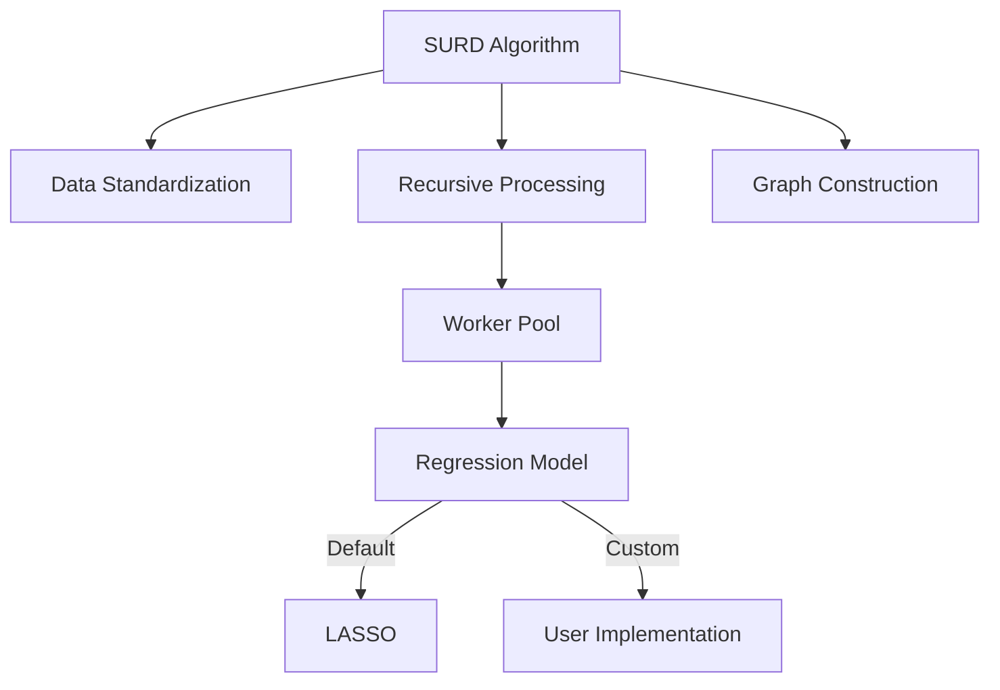

# CausalGo: High-Performance Causal Discovery in Go

[](https://pkg.go.dev/github.com/CausalGo/causalgo)
[](https://opensource.org/licenses/MIT)
[](https://github.com/CausalGo/causalgo/actions/workflows/go.yml)
[](https://goreportcard.com/report/github.com/CausalGo/causalgo)

**CausalGo** is a high-performance implementation of the SURD algorithm (Sparse Unbiased Recursive Regression) for causal discovery in datasets. Based on the [research published in Nature Communications](https://www.nature.com/articles/s41467-024-53373-4), it provides 5-10x speedup compared to the original Python implementation.

## 🔍 Key Features

- 🚀 **Extreme performance** (optimized matrix operations, parallel processing)
- 📊 **Faithful implementation** of the SURD algorithm from the original paper
- 💾 **Memory-efficient** handling of large datasets
- 📈 **Full Gonum integration** for scientific computing in Go
- 🔌 **Plugin architecture** for custom regression models
- ✅ **Comprehensive tests & benchmarks** (validated against reference implementation)

## ⚙️ Installation

```bash
go get github.com/CausalGo/causalgo
```

## 🚀 Quick Start

```go
package main

import (
    "fmt"
    "log"
    "math/rand"
    
    "github.com/CausalGo/causalgo/surd"
    "gonum.org/v1/gonum/mat"
)

func main() {
    // Create synthetic data (100 samples, 3 variables)
    data := mat.NewDense(100, 3, nil)
    for i := 0; i < 100; i++ {
        x := rand.Float64()
        data.Set(i, 0, x)
        data.Set(i, 1, x*0.8+rand.Float64()*0.2)
        data.Set(i, 2, x*0.5+data.At(i, 1)*0.5+rand.Float64()*0.1)
    }
    
    // Configure algorithm
    config := surd.Config{
        Lambda:    0.1,    // LASSO regularization
        Tolerance: 1e-5,   // Convergence threshold
        MaxIter:   1000,   // Maximum iterations
        Workers:   4,      // Use 4 CPU cores
    }
    
    // Initialize and run SURD
    model := surd.New(config)
    result, err := model.Fit(data)
    if err != nil {
        log.Fatalf("Fit error: %v", err)
    }
    
    // Display results
    fmt.Println("Causal Order:", result.Order)
    fmt.Println("Residual Variances:", result.Residuals)
    fmt.Println("Adjacency Matrix:")
    for _, row := range result.Adjacency {
        fmt.Println(row)
    }
}
```

### System Requirements
- **Go 1.24+** (recommended for best performance)
- Linux/macOS/Windows
- 4+ CPU cores for optimal performance

## 🧩 Architecture Overview



## 🔌 Using Custom Regression Models

Implement the `Regressor` interface and inject into SURD:

```go
package main

import (
    "github.com/CausalGo/causalgo/regression"
    "gonum.org/v1/gonum/mat"
)

type CustomRegressor struct{}

// Fit implements the Regressor interface
func (r *CustomRegressor) Fit(X *mat.Dense, y []float64) []float64 {
    // Your custom regression implementation
    weights := make([]float64, X.RawMatrix().Cols)
    // ... training logic ...
    return weights
}

func main() {
    // ... setup data ...
    
    model := surd.New(surd.Config{Workers: 4})
    model.SetRegressor(&CustomRegressor{})
    
    result, err := model.Fit(data)
    // ... handle results ...
}
```

## 🧪 Testing

Run unit tests:
```bash
go test -v ./...
```

Run benchmarks:
```bash
go test -bench=. ./...
```

## 📊 Performance Benchmarks

Benchmarks on Intel i9-12900K (32GB RAM):

| Dataset Size | Variables | Samples | Time/Op (ms) | Throughput |
|--------------|-----------|---------|--------------|------------|
| Small        | 10        | 100     | 12.5         | 80 op/s    |
| Medium       | 50        | 1000    | 185          | 5.4 op/s   |
| Large        | 100       | 5000    | 2,450        | 0.41 op/s  |

[Detailed benchmarks](BENCHMARKS.md)

## 📚 Documentation & Packages

Full documentation available at [pkg.go.dev](https://pkg.go.dev/github.com/CausalGo/causalgo).

### Core Packages:
- **surd**: Main SURD implementation (`New()`, `Fit()`, `Config`)
- **regression**: Regression interfaces and implementations
    - `Regressor` interface
    - `LASSO` implementation
- **graph**: Causal graph results (`GraphResult`)

## 🤝 Contributing

1. Fork the repository
2. Create a feature branch (`git checkout -b feature`)
3. Commit your changes (`git commit -am 'Add new feature'`)
4. Push to the branch (`git push origin feature`)
5. Create a Pull Request

## 📜 License

Distributed under the MIT License. See [LICENSE](LICENSE) for details.

## 📝 Citation

If you use CausalGo in your research, please cite the original SURD paper:

```bibtex
@article{liu2024sparse,
  title={Sparse unbiased recursive regression for causal discovery},
  author={Liu, Weiyu and Cai, Ruichu and Hao, Zhen and Zhang, Kun},
  journal={Nature Communications},
  volume={15},
  pages={1-15},
  year={2024}
}
```

## ✉️ Contact

Project Maintainer: [Andrey Kolkov] - a.kolkov@gmail.com

Project Link: [https://github.com/CausalGo/causalgo](https://github.com/CausalGo/causalgo)

---
**CausalGo** - Unlocking causality at incredible speed! 🔓🚀
